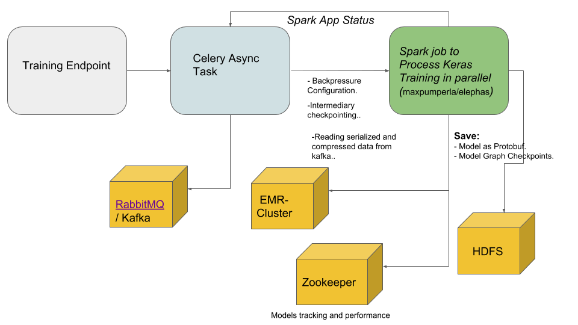
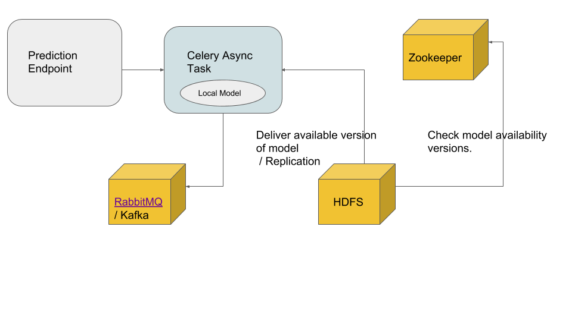

# Hand Written Digits Predictor Service

This project creates a service to classify hand written digits. The projects uses:

* Docker.
* Conda.
* Flask.
* Keras/TF.

## Getting Started

These instructions will get you a copy of the project up and running on your local machine for development and testing purposes. See deployment for notes on how to deploy the project on a live system.

### Prerequisites

You will need to have docker installed in your local machine. Example for ubuntu:

```
sudo apt install docker-ce
```

### Installing

Follow this instructions to install the environment.

* Download the project in you local machine.
```
git clone https://ronald-velocity@bitbucket.org/ronald-velocity/predictor-flask-hd.git
```

**TODO:** This could be within the DockerFile.
**TODO:** In the future use Docker Compose to deploy multiple containers.

* Build your docker container using the Dockerfile.

```
docker build -t "hm-predictor:dockerfile" .
```

* Run your application. 

```
docker run -p 5000:5000  "hm-predictor:dockerfile".
```
## Running service calls

We can call the service endpoints on this way (using sample data):

* Training:

```
curl -X POST -H "Content-Type: application/json" -d '{"images_batch_path": "mnist.npz"}' http://localhost:5000/digits/train
```

sample Output: "True".

* Prediction:

```
curl -X POST -H "Content-Type: application/json" -d '{"image_path": "test/data/n5.p"}' http://localhost:5000/digits/classify
```
sample Output: "[5]".


## Running the tests

The unit test is located in test.classification_service_test.py

to run add:
 
 ```
 python -m classification_service_test.py
```


## Architecture

The microservice is composed by 2 endpoints:

## Training



* The flask service starts an asynchronous task using celery and a Queue.
* The task launch a spark job which runs the training model in parallel.
    - The spark job should use a back pressure strategy to limit the input rate from the source. Gain control, trade-off throughput vs latency.
    - This back pressure could be done writing serialized/compressed images first to kafka.
    - The spark job could also use micro-batching strategies with intermediary checkpoints in HDFS if the data size is huge.
    - The job should take care of a good data partitioning. Smaller partition less memory used, but more shuffling (latency).
    
* The spark job store model and checkpoint in HDFS in format proto buff.
* HDFS is also used to store intermediary checkpoints.    
* The spark task responds with the job finished (heartbeat could be used) status to the task.
* Finally Zookeeper tracks the models versions and performances. 

    
      

## Prediction



* The flask service starts an asynchronous task using celery and a Queue.
* The task gets an available model from HDFS and runs prediction.
* To get the available model, zookeeper makes the Orchestration task.
* The service could have a cache version of the model for extreme cases.

## Acknowledgments

* The complete microservice could work with WSGI, NGINX , Docker compose, Kubernetes.

* Kubernetes and NGINX could give the following advantages:
    - Load Balancing.
    - POD Replication.
    - Service discovery.


